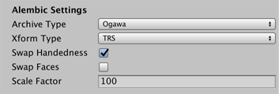

# Alembic Recorder Clip component

The Alembic Recorder Clip component allows you to capture animation from GameObjects in Timeline and save it out to an Alembic file.

The following topics explain the properties of the Alembic Recorder Clip component in detail:

- [**Output Path** section](#recordRef_A)
- [**Alembic Settings** section](#recordRef_B)
- [**Capture Settings** section](#recordRef_C)
- [**Capture Components** option group](#recordRef_D)
- [**Mesh Components** option group](#recordRef_E)
- [**Ignore First Frame** option](#recordRef_F)
- [**Misc** section](#recordRef_H)

## Output Path section

Specify the location to save the Alembic file to. By default, the output path is relative to the current Unity Project path.

## Alembic Settings section

Use these settings to define the properties of the Alembic output.

| ***Property***      |            | ***Description***                                            |
| :------------------ | :--------- | :----------------------------------------------------------- |
| __Archive Type__    |            | Choose the Alembic format specification.                     |
|                     | __HDF5__   | This is a common hierarchical data format for Alembic.       |
|                     | __Ogawa__  | This format produces smaller files and better performance than HDF5. This is the default format. |
| __Xform Type__      |            | Choose the transform type.                                   |
|                     | __Matrix__ | Record the full transformation matrix.                       |
|                     | __TRS__    | Record the TRS channels for position, rotation, scale of an object. This is the default transform type. |
| __Swap Handedness__ |            | Enable to change from a left hand coordinate system (Unity) to a right hand coordinate system (Autodesk® Maya®). |
| __Swap Faces__      |            | Enable to reverse the front and back of all faces.           |
| __Scale Factor__    |            | Set scale factor to convert between different system units. For example, using 0.1 will convert the Unity units to 1/10 of their value in the resulting Alembic file. This also affects position and speed. |

## Capture Settings section

Use these settings to determine the set of target GameObject(s) for the current capture. 

| ***Property***                             |                   | ***Description***                                            |
| :----------------------------------------- | :---------------- | :----------------------------------------------------------- |
| __Scope__                |                   | Choose the scope of the export. By default, this is set to the **Entire Scene**. |
|                          | __Entire Scene__  | Export the entire Scene. This is the default.                |
|                          | __Target Branch__ | Export only a branch (or hierarchy) of the Scene. When you choose this option, the Capture Settings **Target** property appears, which allows you to select a GameObject. |
| __Target__               |                   | Set a reference to the GameObject that is the root of the hierarchy you want to export. This property is only available if the **Scope** property is set to __Target Branch__. |
| __Static MeshRenderers__ |                   | Enable this option to skip capturing animation on static Meshes. |

## Capture Components option group

Use these settings to define which components to save data for.

| ***Property***          | ***Description***                                            |
| :---------------------- | :----------------------------------------------------------- |
| __MeshRenderer__        | Enable to record [MeshRenderer](https://docs.unity3d.com/Manual/class-MeshRenderer.html) components. |
| __SkinnedMeshRenderer__ | Enable to record [SkinnedMeshRenderer](https://docs.unity3d.com/Manual/class-SkinnedMeshRenderer.html) components. |
| __ParticleSystem__      | Enable to record [ParticleSystem](https://docs.unity3d.com/Manual/class-ParticleSystem.html) components. |
| __Camera__              | Enable to record [Camera](https://docs.unity3d.com/Manual/class-Camera.html) components. |

## Mesh Components option group

Use these settings to fine-tune the Mesh data you are saving.

> ***Note:*** Material export is not supported, as it is not supported in Alembic.

| ***Property***   | ***Description***               |
| :--------------- | :------------------------------ |
| __Normals__      | Enable to record mesh normals.  |
| __UV1__          | Enable to record mesh UV1.      |
| __UV2__          | Enable to record mesh UV2.      |
| __Vertex Color__ | Enable to record vertex colors. |
| __Submeshes__    | Enable to record sub-Meshes.    |

## Ignore First Frame option

Enable the **Ignore First Frame** option to skip capturing the first frame. 

## Misc section

Enable the __Detailed Log__ option to provide Debug logging for each captured frame. 

